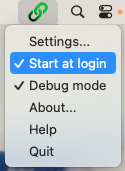

# Teams Connex for Home Assistant

Status bar app for macOS that locally connects to Microsoft Teams and forwards meeting information
to Home Assistants via a webhook.

[Official Documentation](https://neon.ninja/teams-connex/)
