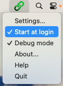

| :warning: WARNING           |
|:----------------------------|
| [Microsoft has deprecated the local Teams API](https://feedbackportal.microsoft.com/feedback/idea/f66d7f94-96ef-f011-92b8-7c1e52eaa20d) back in December 2025, and this API has been removed from Teams clients on 30 June 2026. Until I can find something that works locally with Microsoft Teams on macOS, unfortunately this project will remain inactive. |

# Teams Connex for Home Assistant

Status bar app for macOS that locally connects to Microsoft Teams and forwards meeting information
to Home Assistants via a webhook.

[Official Documentation](https://neon.ninja/teams-connex/)
